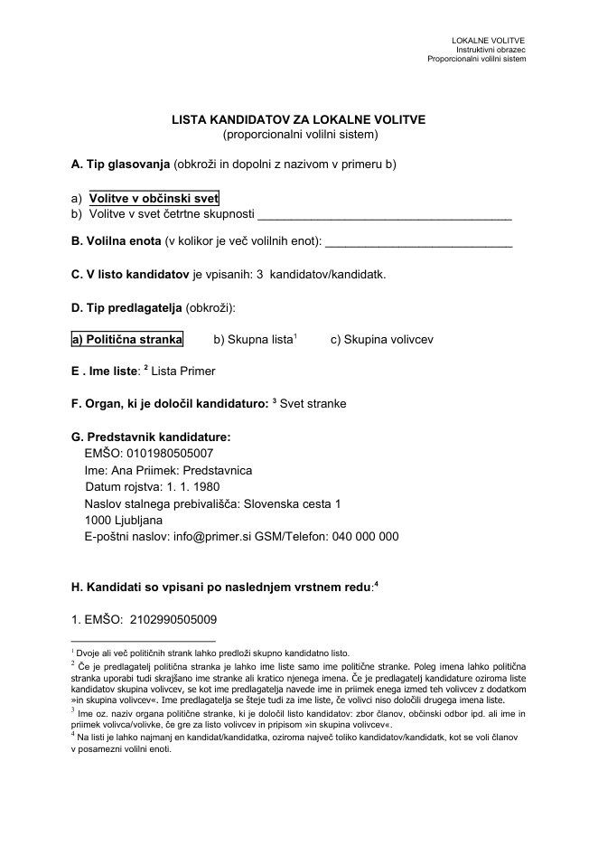
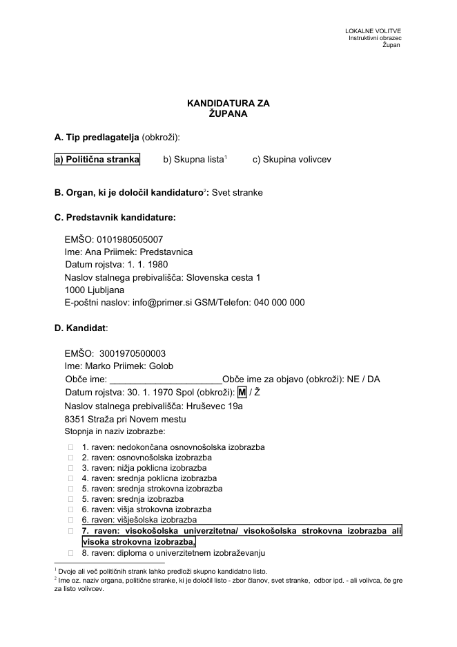
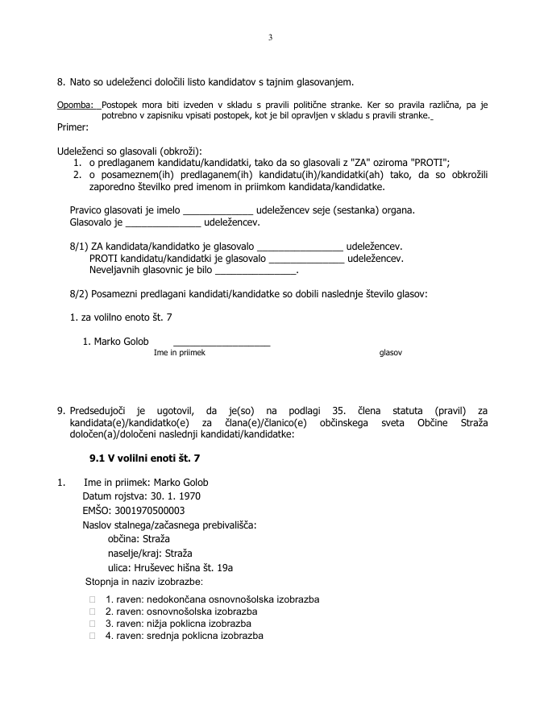

# lokalne-volitve-helper

Zbirka skript, ki pridejo prav za izpolnjevanje birokracije na lokalnih volitvah. Nazadnje
posodobljeno za **lokalne volitve 2026** (15. 11. 2026).

Iz izvoza obrazca za evidentiranje kandidatov ustvari izpolnjene Wordove obrazce (`.docx`),
razvrščene po občinah:

- **Lista kandidatov** (proporcionalni sistem) in **Kandidatura** (večinski sistem) za občinski
  svet ter svete četrtnih, krajevnih in vaških skupnosti
- **Kandidatura za župana**
- **Soglasja** kandidatov (občinski svet, župan)
- **Zapisniki o delu organa politične stranke** (lista, večinski sistem, župan)

Volilne enote in četrtne/krajevne skupnosti poišče samodejno v **registru naslovov GURS
(eProstor)**, preveri **EMŠO** in uredi neurejene vnose (»MOL«, »Gradiska ul.«, izgubljene
ničle v EMŠO ...).

| Lista kandidatov | Kandidatura za župana | Zapisnik |
|---|---|---|
|  |  |  |

## Namestitev

Potreben je Python 3.10+.

```bash
pip install -r requirements.txt
```

## Uporaba

```bash
python volitve.py pripravi "Evidentacija kandidatov (responses).xlsx"
```

Odprite ustvarjeno `priprava.xlsx` in dopolnite:

- **Občine** → `Volilni sistem` (proporcionalni / večinski) za vsako občino,
- **Nastavitve** → predlagatelj, organ, ime liste, predstavnik kandidature, podatki o seji,
- **Kandidati** → preglejte `Opombe` (neveljaven EMŠO, nenajden naslov ...), volilne enote in
  vrstni red.

```bash
python volitve.py generiraj
```

Obrazci so v `output/<Občina>/`, seznam in opozorila v `output/povzetek.txt`.

Preverjanje EMŠO posebej:

```bash
python volitve.py preveri-emso priprava.xlsx
```

📖 **Podrobna navodila:** [docs/NAVODILA.md](docs/NAVODILA.md) – vsi stolpci, nastavitve,
pomen opomb, kaj se izpolni v posameznem obrazcu, pogoste težave in posodobitev za nove volitve.

## Primer

Mapa [`primer/`](primer) vsebuje izmišljen izvoz (`vhod_primer.xlsx`, `vhod_primer.csv`),
dopolnjeno pripravo (`priprava_primer.xlsx`) in vse ustvarjene obrazce (`rezultat/`).

```bash
python volitve.py generiraj primer/priprava_primer.xlsx -o output_primer
```

## Testi

```bash
pip install -r requirements-dev.txt
python -m pytest              # brez omrežja
python -m pytest --network    # tudi testi proti servisu eProstor
```

## Varstvo podatkov

Datoteke z osebnimi podatki kandidatov (`*.xlsx`, `*.csv`, `output/`) so izključene iz gita
(razen primerov z izmišljenimi podatki). Servisu eProstor se pošiljajo le naslovi (ulica,
hišna številka, pošta), ne imena ali EMŠO.
